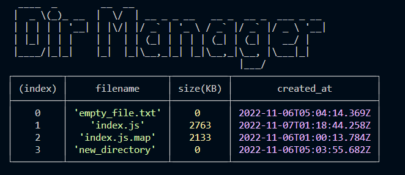

# Dir Manager
This app is designed to work with files and directories. With Dir Manager, you can create files, delete files, and get information about files. The information is displayed in a table listing the file's name, size, and time of creation.



## How to use
Dir Manager takes terminal commands. In the terminal, enter the following: 
```
$ dirmanager
``` 

You should then see a list of dirmanager commands:

```
-V, --version        output the version number
-l, --ls  [value]    List directory contents  
-m, --mkdir <value>  Create a directory       
-t, --touch <value>  Create a file
-h, --help           display help for command
```
# Credit
This app was made from a tutorial by [Stanley Ulili](https://blog.logrocket.com/author/stanleyulili/) that can be found [here on LogRocket](https://blog.logrocket.com/building-typescript-cli-node-js-commander/). Thanks, Stanley!